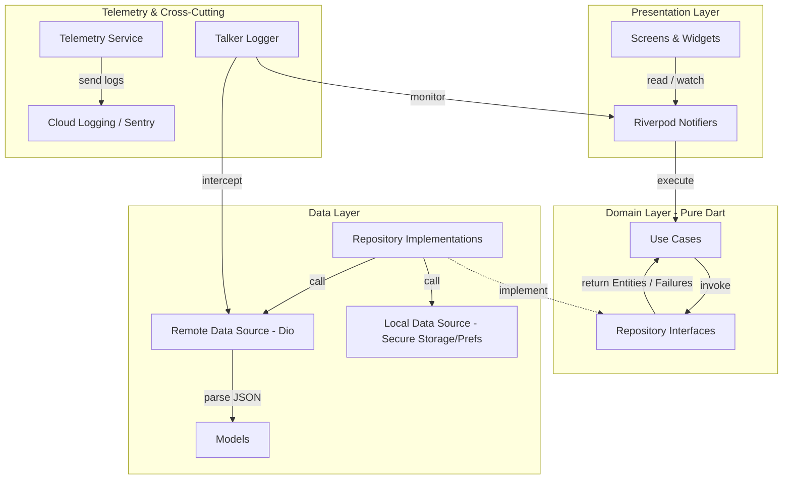

# Hakeem Architecture Redesign Plan

This document outlines the proposed production-grade architectural redesign for **Hakeem**—a government-level healthcare application. The plan introduces a structured skeleton, robust error-handling patterns, state management standards, telemetry/logging frameworks, and a Git/GitHub branching workflow.

---

## Morgan's Assessment

> [!IMPORTANT]
> Reviewed against the actual repo, not just the proposal: 11 features already exist under manual Riverpod `Notifier`/`Provider` (no codegen), auth talks to a real REST API (`https://api.hakeem.jo` via Dio, national-ID/phone/Sanad login), and `.github/workflows/` currently only has Gemini automation — there is no build/test CI at all yet.
>
> **What's right:** `Either<Failure, T>` for a healthcare app is correct — silent exceptions in a clinical flow are a compliance risk, not just a bug. Talker for centralized logging is the right call for auditability. The domain→data→presentation skeleton already matches CLAUDE.md.
>
> **What was wrong in the original draft, now fixed below:** (1) it proposed migrating all 11 features to Riverpod Generator + fpdart in one pass — that's a big-bang rewrite risk on a live app; the plan below sequences it feature-by-feature instead. (2) It left the backend platform as an open question — **resolved: Supabase fully replaces `api.hakeem.jo`** (Postgres + Auth + Storage + Edge Functions), so the data layer redesign now has a concrete target. (3) It had no offline-sync design — Supabase has no built-in offline cache like Firebase, so one is specified below (local SQLite via `drift` as source-of-truth + sync queue).

**Key decisions (approved):**
1. **Riverpod Generator migration** — feature-by-feature, starting with `auth` (foundation for everything else), not a single rewrite.
2. **Functional error handling (`fpdart`)** — `Either<Failure, Success>` in all use cases/repositories, migrated alongside each feature's Supabase cutover (same PR, same review).
3. **Centralized logging (`talker`)** — `talker_flutter` + `talker_dio_logger`/interceptor for Supabase client + `talker_riverpod_logger`, toggleable in-app panel gated behind a debug flag (never shipped visible in release builds for a gov app).
4. **Supabase — full backend replacement.** All 11 features migrate their datasources off Dio/`api.hakeem.jo` onto `supabase_flutter`. See [Supabase Architecture](#5-supabase-architecture-full-backend-replacement) below.

---

## Open Questions

> [!WARNING]
> Still need answers before coding starts on the features these affect:
>
> 1. **Existing user data migration:** Is there production user data in `api.hakeem.jo`'s database today that needs a one-time export/import into Supabase Postgres, or is this pre-launch with no real users yet? This determines whether we need a migration script + downtime window.
> 2. **Data residency:** Supabase projects run on AWS regions (no Jordan/MENA region as of now) — does the government mandate require in-country hosting? If yes, self-hosted Supabase (Docker on your own infra) replaces hosted Supabase, which changes the CI/CD deploy story materially.
> 3. **Sanad SSO integration:** the `sanad_button`/`signup_sanad_banner` widgets suggest integration with Jordan's national Sanad login. Supabase Auth supports custom OIDC providers — is Sanad OIDC-compliant, or does it need a custom Edge Function bridge?

---

## Proposed Changes

We will restructure the application skeleton and update core layers without deleting any features. The refactoring will establish strict layers and clean dependencies.



### 1. Reorganized Skeleton Structure

We will refactor the files under `lib/core/` and the feature directories to enforce the following structure:

```
lib/
├── core/
│   ├── constants/             # Design tokens (colors, spacing, typography)
│   ├── theme/                 # AppTheme configurations
│   ├── router/                # GoRouter configuration & route logging
│   ├── network/               # Centralized Dio client, custom interceptors (Auth, Talker, Retry)
│   ├── error_handling/        # Base Failure classes, Exception mapping
│   ├── telemetry/             # Telemetry service, Talker configurations, Cloud logger integrations
│   ├── l10n/                  # Localization (AppLocalizations)
│   └── providers/             # Global core providers (SharedPreferences, SecureStorage, local_auth)
├── features/
│   └── <feature_name>/
│       ├── domain/
│       │   ├── entities/      # Pure business models (immutable)
│       │   ├── repositories/  # Abstract repository interfaces returning Either<Failure, T>
│       │   └── usecases/      # Single-responsibility use case classes
│       ├── data/
│       │   ├── models/        # DTOs, JSON parsing (Freezed/JSON Serializable)
│       │   ├── datasources/   # Remote (Dio) and Local datasources
│       │   └── repositories/  # Repository implementations + error handling mapping
│       └── presentation/
│           ├── providers/     # Code-generated Riverpod Notifiers
│           ├── screens/       # Views bound to GoRouter
│           └── widgets/       # Atomic, reusable UI components
```

---

### 2. Dependency & Package Optimization

We recommend incorporating the following optimized, industry-standard packages on `pub.dev`:

| Package Name | Purpose | Rationale for Production/Government App |
| :--- | :--- | :--- |
| **`fpdart`** | Functional programming primitives (`Either`, `Option`, `TaskEither`) | Eliminates unpredictable runtime crashes by handling errors as values rather than throwing exceptions. |
| **`talker_flutter`** | Advanced logging, HTTP logging, error catching, and debug console | Consolidates error reports, network logs, and state changes. Includes a secure, toggleable in-app inspector screen for testers. |
| **`talker_dio_logger`** | Automated Dio network request/response logging | Easy inspection of API calls without print statements, fully integrated with Talker. |
| **`talker_riverpod_logger`** | Riverpod state change monitoring | Auto-logs state lifecycle events (initialized, updated, disposed) to diagnose state issues instantly. |
| **`riverpod_annotation`** | Modern type-safe Riverpod provider definition | Standardizes DI, supports compile-time generation of providers, and optimizes memory management. |

---

### 3. Core Architectural Concepts

#### A. Functional Error Handling Pattern (`fpdart`)
Use Cases and Repositories will return `Either<Failure, T>` instead of throwing exceptions.

```dart
// Domain Layer: UseCase definition
class LoginUseCase {
  final AuthRepository _repository;
  LoginUseCase(this._repository);

  Future<Either<Failure, UserEntity>> call({
    required String identifier,
    required String password,
    required LoginMethod method,
  }) {
    return _repository.login(
      identifier: identifier,
      password: password,
      method: method,
    );
  }
}
```

```dart
// Data Layer: Repository implementation mapping DioExceptions to Failures
class AuthRepositoryImpl implements AuthRepository {
  final AuthRemoteDatasource _datasource;

  AuthRepositoryImpl(this._datasource);

  @override
  Future<Either<Failure, UserEntity>> login({
    required String identifier,
    required String password,
    required LoginMethod method,
  }) async {
    try {
      final userModel = await _datasource.login(
        LoginRequestModel(identifier: identifier, password: password, method: method.name),
      );
      return Right(userModel);
    } on DioException catch (e, stackTrace) {
      // Log to Talker
      talker.handle(e, stackTrace, 'DioException during login');
      return Left(ServerFailure.fromDioException(e));
    } catch (e, stackTrace) {
      talker.handle(e, stackTrace, 'Unexpected error during login');
      return Left(UnexpectedFailure(e.toString()));
    }
  }
}
```

#### B. State Management Pattern (Riverpod Generator)
Migrate presentation states to use `@riverpod` annotations, improving safety and auto-disposal.

```dart
import 'riverpod_annotation/riverpod_annotation.dart';
part 'login_notifier.g.dart';

@riverpod
class LoginNotifier extends _$LoginNotifier {
  @override
  LoginState build() {
    return const LoginState();
  }

  Future<void> login(String identifier, String password) async {
    state = state.copyWith(status: LoginStatus.loading);
    
    final result = await ref.read(loginUseCaseProvider)(
      identifier: identifier,
      password: password,
      method: state.activeTab,
    );
    
    state = result.fold(
      (failure) => state.copyWith(status: LoginStatus.failure, errorMessage: failure.message),
      (user) => state.copyWith(status: LoginStatus.success),
    );
  }
}
```

#### C. Telemetry and Logging Architecture
- **Global Error Interception:** Wrap `runApp` with `Talker` boundary to catch all Flutter framework errors, Zone errors, and platform exceptions.
- **Dio Client Interceptor:** Auto-attach `TalkerDioLogger` to log all API requests and responses.
- **Riverpod Observer:** Attach `TalkerRiverpodObserver` to track Riverpod state changes.
- **Cloud/Web Sync:** A telemetry worker runs in the background. If online, critical error logs (e.g. ServerFailures, App Crashes) are buffered locally and batched-uploaded to the Cloud Logging service or Web tracking dashboard.

---

### 4. Git Version Control & GitHub Workflow

For a secure, multi-developer government healthcare app, we propose a strict branching and merge control strategy:

```
[Main]        ======================= (Release / Production)
                ^
                | (Release Tag & Hotfixes)
[Develop]     ======================= (Staging / Integration / QA)
                ^         ^
                |         | (Pull Request + Squash Merge after approval)
[Feature/Fix]  ----      ---- (Developer work branches)
```

1. **Branches:**
   - `main`: Production-ready code, matches the latest store deployment.
   - `develop`: Integration branch. Automated builds deploy to staging/internal testing from here.
   - `feature/<name>` or `bugfix/<name>`: Short-lived developer branches branching from `develop`.
2. **Branch Protection Rules (GitHub):**
   - Enforce linear history.
   - Require Pull Requests before merging into `main` or `develop`.
   - Require at least 1 peer approval.
   - Require all status checks (Linting & Unit Tests) to pass before merging.
3. **Automated CI Checks (GitHub Actions):**
   - **Linter Check:** `flutter analyze --fatal-warnings`
   - **Formatter Check:** `dart format --output=none --set-exit-if-changed .`
   - **Unit Tests:** `flutter test --coverage`
   - **Security Scan:** Check for hardcoded credentials (using secret scanner tools like TruffleHog or GitGuardian).

---

### 5. Supabase Architecture (Full Backend Replacement)

`supabase_flutter` replaces `dio` + `flutter_secure_storage`-for-tokens as the datasource layer. `dio` stays only if a feature needs a non-Supabase third-party call (e.g. an LLM API from a Supabase Edge Function, not the client).

#### A. Auth
- Supabase Auth (GoTrue) replaces the custom JWT flow in `auth_remote_datasource.dart`. Session persistence is handled by `supabase_flutter` automatically (no more manual secure-storage token handling).
- `LoginMethod` enum (phone/national-ID/Sanad) maps to: phone → Supabase phone OTP; national ID → custom table lookup + `signInWithPassword` or magic link; Sanad → OIDC custom provider **if** Sanad exposes OIDC (open question above) — otherwise an Edge Function verifies the Sanad token server-side and mints a Supabase session via `admin.generateLink`/custom JWT.
- `local_auth` (biometric) is unaffected — it gates re-entry to an already-persisted Supabase session, it doesn't replace Supabase Auth.

#### B. Postgres schema & RLS
- One schema per feature domain (`auth`, `family_hub`, `medical_records`, `appointments`, `smart_health`, `ai_assistant`), migrations tracked in `supabase/migrations/` and committed to git — **never edited via the dashboard in production**.
- Every patient-data table gets RLS enabled by default, deny-by-default, with explicit policies:
  ```sql
  alter table medical_records enable row level security;

  create policy "owner can read own records"
    on medical_records for select
    using (auth.uid() = patient_id);

  create policy "family member can read if explicitly shared"
    on medical_records for select
    using (
      exists (
        select 1 from family_shares
        where family_shares.record_id = medical_records.id
        and family_shares.shared_with_user_id = auth.uid()
      )
    );
  ```
- `family_hub` needs a `family_links` table (guardian ↔ dependent) driving RLS on every other table a family member can see — design this table first, everything else's RLS depends on it.

#### C. Storage
- Buckets: `medical-documents`, `avatars`. Storage RLS policies mirror table policies (`storage.objects` policy keyed on `auth.uid()` matching a path prefix, e.g. `medical-documents/{user_id}/...`).

#### D. Edge Functions
- Use for anything that must not run with the client's RLS-scoped permissions or must hide a secret: AI Assistant's LLM API key, genetic-risk-flag computation in Family Hub (cross-patient read that a single user's RLS shouldn't allow directly), Sanad token verification.
- Each Edge Function gets a typed request/response contract documented next to the function (input schema, output schema, error codes) — same discipline as the Dart `Either<Failure,T>` contracts.

#### E. Offline-first sync
- Supabase has no built-in offline cache. Introduce `drift` (SQLite) as the **local source of truth during a session**: writes go to Drift immediately (optimistic), a background sync worker pushes to Supabase and reconciles via `updated_at` + a `sync_status` column (`pending`/`synced`/`conflict`).
- Realtime subscriptions (`supabase_flutter`'s `.stream()`) update the Drift cache when other devices/family members push changes — this is what feeds the Riverpod `AsyncNotifier` layer, not direct network calls.

#### F. Migration sequencing (per-feature, not big-bang)
1. **`auth`** first — every other feature depends on `auth.uid()` for RLS.
2. **`family_hub`** second — its `family_links` table is a dependency for RLS policies in every clinical feature.
3. Remaining features (`medical_records`, `appointments`, `smart_health`, `ai_assistant`, `patient_dashboard`) migrate in parallel once 1–2 are stable, each as its own PR: swap datasource → add fpdart `Either` → add Riverpod Generator → add RLS policies + tests.
4. Old `dio`/`api.hakeem.jo` code is deleted feature-by-feature as each migration lands — no long-lived dual-backend code path per feature.

---

### 6. GitHub Actions CI/CD

The repo already has Gemini automation workflows (`gemini-review.yml`, `gemini-triage.yml`, etc.) — these stay untouched. Add a **separate** build/test pipeline alongside them:

`.github/workflows/ci.yml`:
```yaml
name: CI
on:
  pull_request:
    branches: [main, develop]
  push:
    branches: [main, develop]

jobs:
  analyze-and-test:
    runs-on: ubuntu-latest
    steps:
      - uses: actions/checkout@v4
      - uses: subosito/flutter-action@v2
        with:
          channel: stable
      - run: flutter pub get
      - run: dart run build_runner build --delete-conflicting-outputs
      - run: dart format --output=none --set-exit-if-changed .
      - run: flutter analyze --fatal-warnings
      - run: flutter test --coverage
      - name: Secret scan
        uses: trufflesecurity/trufflehog@main
        with:
          extra_args: --only-verified

  build-android:
    needs: analyze-and-test
    if: github.ref == 'refs/heads/main'
    runs-on: ubuntu-latest
    steps:
      - uses: actions/checkout@v4
      - uses: subosito/flutter-action@v2
        with:
          channel: stable
      - run: flutter pub get
      - run: flutter build apk --release
      - uses: actions/upload-artifact@v4
        with:
          name: release-apk
          path: build/app/outputs/flutter-apk/app-release.apk
```
- Supabase migrations are **not** auto-applied by this workflow — `supabase/migrations/*.sql` changes go through PR review, then `supabase db push` is run manually (or via a separate, manually-triggered `workflow_dispatch` job) against the target project. Auto-applying schema changes to a healthcare DB on every merge is a data-loss risk, not a convenience.
- Branch protection on `main`/`develop`: require the `analyze-and-test` job green + 1 approval before merge, as already specified in the branching section above.

---

## Verification Plan

### Automated Verification
- `flutter analyze --fatal-warnings` — 0 errors/warnings (enforced by CI on every PR).
- `flutter test --coverage` — existing behavior preserved per migrated feature.
- `dart run build_runner build --delete-conflicting-outputs` — Riverpod Generator + Freezed codegen succeeds per feature as it migrates.
- CI green (`ci.yml`) required before merge to `main`/`develop`.

### Manual Verification
- Per-feature Supabase cutover: confirm RLS policies actually block cross-user access (test with two accounts, not just the happy path).
- In-app debug panel (Talker) opens and populates correctly, and is confirmed **not reachable in release builds**.
- Network/Supabase error scenarios (offline, RLS denial, Edge Function failure) produce correct Arabic error messaging.
- Offline test: airplane-mode write → reconnect → confirm Drift sync queue reconciles without data loss or duplication.
- Auth cutover: existing login (national ID/phone/Sanad) still works end-to-end against Supabase Auth before old `api.hakeem.jo` auth code is deleted.
