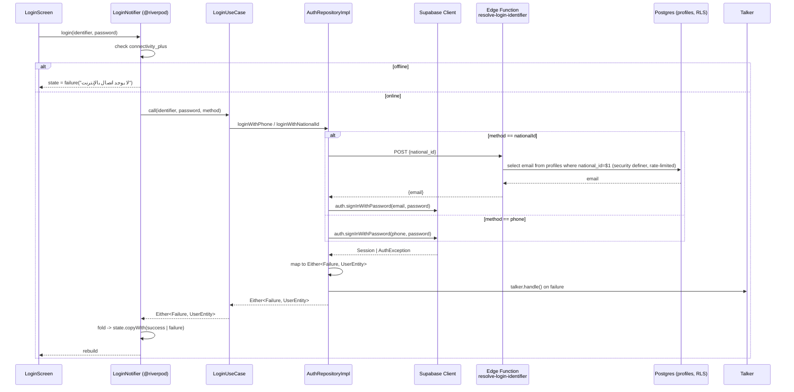
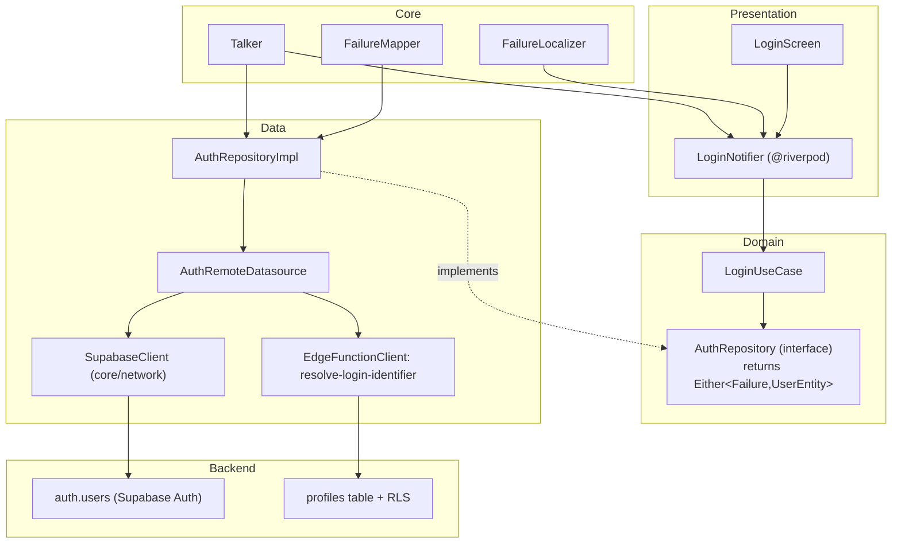

# Auth Feature — Technical Migration Plan (Supabase + fpdart + Riverpod Generator)

This is the fully-worked first vertical slice referenced in `architecture_redesign_plan.md` §5F. Every other feature (`family_hub`, `medical_records`, `appointments`, `smart_health`, `ai_assistant`, `patient_dashboard`) repeats this exact pattern — this document is the template. Agents building those features must follow [`../AGENTS.md`](../AGENTS.md), which points back here.

---

## 1. Architecture Diagram — Login Flow (Post-Migration)

## 2. Layer Diagram (Where Each New Piece Lives)

---

## 3. File Manifest

### New files

| File | Purpose |
|---|---|
| `lib/core/network/supabase_client_provider.dart` | `Provider<SupabaseClient>` — single shared client, initialized in `main.dart` via `Supabase.initialize()`. |
| `lib/core/error_handling/failure.dart` | Sealed `Failure` class: `AuthFailure`, `NetworkFailure`, `ServerFailure`, `UnexpectedFailure`. Replaces string-typed errors app-wide. |
| `lib/core/error_handling/failure_mapper.dart` | `Failure mapAuthException(AuthException e)` / `mapPostgrestException(...)` — converts Supabase exceptions to `Failure`, one mapper reused by every feature. |
| `lib/core/error_handling/failure_localizer.dart` | `String localize(Failure f)` — Arabic message per `Failure` subtype/code. Replaces the ad-hoc `_mapDioError` switch duplicated per notifier today. |
| `lib/core/telemetry/talker_provider.dart` | `Provider<Talker>` configured with `TalkerDioLogger`-equivalent for Supabase (custom logging interceptor, since Supabase client isn't Dio-based) + `TalkerRiverpodLogger`. |
| `supabase/migrations/0001_profiles_and_auth.sql` | `profiles` table (`id uuid references auth.users`, `national_id text unique`, `phone text`, `full_name text`), RLS: owner-only read/write. |
| `supabase/functions/resolve-login-identifier/index.ts` | Edge Function: given `national_id`, returns the associated auth email/phone via a `security definer` RPC — never exposes other profile fields, and is rate-limited to block national-ID enumeration. |
| `test/core/error_handling/failure_mapper_test.dart` | Unit test: every `AuthException` code maps to the right `Failure`. |
| `test/features/auth/domain/usecases/login_usecase_test.dart` | Unit test: `LoginUseCase` dispatches to the right repository method per `LoginMethod`, propagates `Either`. |
| `test/features/auth/data/repositories/auth_repository_impl_test.dart` | Unit test with a fake `AuthRemoteDatasource`: success path returns `Right`, thrown `AuthException` returns `Left`. |
| `test/features/auth/presentation/providers/login_notifier_test.dart` | Widget/provider test: offline → failure state without calling the use case; online success/failure → correct `LoginState`. |
| `supabase/tests/profiles_rls_test.sql` | pgTAP test: user A cannot `select`/`update` user B's `profiles` row; user A can read/update their own. |

### Modified files

| File | Change |
|---|---|
| `lib/features/auth/domain/repositories/auth_repository.dart` | Return type `Future<UserEntity>` → `Future<Either<Failure, UserEntity>>` on both methods. |
| `lib/features/auth/domain/usecases/login_usecase.dart` | Return type updated to match; logic (the `switch` dispatch) is unchanged. |
| `lib/features/auth/data/datasources/auth_remote_datasource.dart` | Dio POST to `/auth/login` replaced with `supabase.auth.signInWithPassword(...)`; national-ID path first calls the Edge Function to resolve the identifier, then signs in. |
| `lib/features/auth/data/repositories/auth_repository_impl.dart` | Wrap datasource calls in `try/catch`, use `FailureMapper` + `talker.handle(...)`, return `Either`. |
| `lib/features/auth/data/models/user_model.dart` | `fromJson` now builds from a Supabase `Session`/`User` + joined `profiles` row instead of a flat REST JSON body. |
| `lib/features/auth/data/providers/auth_providers.dart` | Convert manual `Provider(...)` definitions to `@riverpod` functions; `dioProvider`/`authDatasourceProvider` reference removed for this feature, replaced with `supabaseClientProvider`. |
| `lib/features/auth/presentation/providers/login_notifier.dart` | `Notifier<LoginState>` → `@riverpod class LoginNotifier`. Replace `_mapDioError` with `ref.read(failureLocalizerProvider).localize(failure)`. Biometric logic (`loginWithBiometric`, `_checkBiometricSupport`) is untouched — it doesn't talk to the backend. |
| `pubspec.yaml` | Add `supabase_flutter`, `fpdart`, `talker_flutter`, `talker_riverpod_logger`. |

### Deleted (once this slice is verified and merged)

| File/code | Why |
|---|---|
| `dioProvider` usage inside `auth_providers.dart` | No longer needed for auth specifically — **kept in `core/network/` only if other not-yet-migrated features still depend on it.** Do not delete `dio` from `pubspec.yaml` until every feature has migrated. |

---

## 4. Function-Level Reference

Every function below either already exists (marked **unchanged**) or is new/modified (marked **new**/**modified**) — this is the "explain every function" record agents must keep current as they build.

| Function | Signature | Status | What it does / how |
|---|---|---|---|
| `LoginUseCase.call` | `Future<Either<Failure, UserEntity>> call({required String identifier, required String password, required LoginMethod method})` | modified | Dispatches to `loginWithPhone`/`loginWithNationalId` on the repository based on `method`; identical control flow to today, only the return type changes. |
| `AuthRepositoryImpl.loginWithPhone` | `Future<Either<Failure, UserEntity>> loginWithPhone({required String phone, required String password})` | modified | Calls `datasource.loginWithPhone`, wraps result: `Right(UserEntity)` on success, catches `AuthException`/`PostgrestException`, maps via `FailureMapper`, logs via `Talker`, returns `Left(Failure)`. |
| `AuthRepositoryImpl.loginWithNationalId` | same shape, national ID | modified | Same as above but datasource internally does the two-step resolve→sign-in. |
| `AuthRemoteDatasourceImpl.loginWithPhone` | `Future<UserModel> loginWithPhone(...)` | modified | `supabase.auth.signInWithPassword(phone: phone, password: password)`, then fetch/join `profiles` row for `UserModel.fromJson`. |
| `AuthRemoteDatasourceImpl.loginWithNationalId` | `Future<UserModel> loginWithNationalId(...)` | new | 1) call Edge Function `resolve-login-identifier` with `{national_id}` → get `{email}`. 2) `supabase.auth.signInWithPassword(email: email, password: password)`. Throws `AuthException` if either step fails — caught upstream by the repository. |
| `FailureMapper.mapAuthException` | `Failure mapAuthException(AuthException e)` | new | Switches on `e.code`/`e.statusCode`: `invalid_credentials` → `AuthFailure.invalidCredentials`, `email_not_confirmed` → `AuthFailure.notConfirmed`, rate-limit codes → `AuthFailure.rateLimited`, else `UnexpectedFailure`. |
| `FailureLocalizer.localize` | `String localize(Failure f)` | new | One switch, one place, replacing the per-feature `_mapDioError`-style duplication. Returns the existing Arabic strings (`'بيانات الدخول غير صحيحة'`, etc.) keyed by `Failure` subtype instead of HTTP status code. |
| `LoginNotifier.login` | `Future<void> login({required String identifier, required String password})` | modified | Same connectivity pre-check as today (unchanged). Calls `LoginUseCase`, then `result.fold((f) => state = state.copyWith(failure: localizer.localize(f)), (user) => state = state.copyWith(success))` instead of try/catch on `DioException`. |
| `LoginNotifier.loginWithBiometric` | unchanged | unchanged | No backend dependency — biometric gating stays exactly as implemented today. |
| `LoginNotifier.switchTab` / `togglePassword` | unchanged | unchanged | Pure UI-state toggles, no backend coupling. |
| `resolve-login-identifier` (Edge Function) | `POST { national_id: string } -> { email: string } | 404` | new | Deno function calling a `security definer` Postgres RPC `resolve_identifier(national_id text)` that does the lookup with elevated privilege (bypassing RLS safely, since it returns only the one field needed) — the client never gets direct table access for this lookup, preventing enumeration via RLS-bypass tricks. Rate-limited at the Edge Function level (max N requests/IP/minute). |

---

## 5. Testing Matrix

| Layer | Test type | What's verified |
|---|---|---|
| `FailureMapper` | Unit | Every known `AuthException` code → correct `Failure` subtype. Unknown code → `UnexpectedFailure`, never throws. |
| `LoginUseCase` | Unit (fake repo) | Correct repository method called per `LoginMethod`; `Either` passed through unchanged. |
| `AuthRepositoryImpl` | Unit (fake datasource) | Success → `Right`; thrown exception → `Left` with correctly mapped `Failure`; `talker.handle` invoked on failure path. |
| `LoginNotifier` | Provider test (`ProviderContainer` + overridden `authRepositoryProvider`) | Offline branch never reaches the use case; success/failure states match; biometric path untouched. |
| `profiles` RLS | pgTAP (`supabase test db`) | User A: `select`/`update` on own row succeeds; on user B's row, 0 rows returned (not an error — RLS silently filters, which the test must assert explicitly). |
| `resolve-login-identifier` | Integration (local `supabase functions serve`) | Valid `national_id` → `{email}`; unknown `national_id` → `404`, not a stack trace; N+1 rapid calls from same IP → rate-limited. |
| End-to-end | Manual (per Verification Plan in main doc) | Real login with phone and national ID against local Supabase stack (`supabase start`), before deleting the old Dio path. |

**Gate to merge this slice:** all of the above green, `flutter analyze --fatal-warnings` clean, old `api.hakeem.jo` auth endpoint call sites fully removed from the `auth` feature (not just unused — deleted).

---

## 6. Pattern for the Remaining Features

Every other feature follows sections 3–5 above with its own nouns. Do not write a fresh technical plan from scratch per feature — copy this file's structure (`docs/features/<feature>_slice_technical_plan.md`... actually keep these under `plan/`), fill in the file manifest and function table for that feature's actual files, and get the same testing matrix categories (mapper/usecase/repo/notifier/RLS/edge-function/e2e) populated before calling it done.
